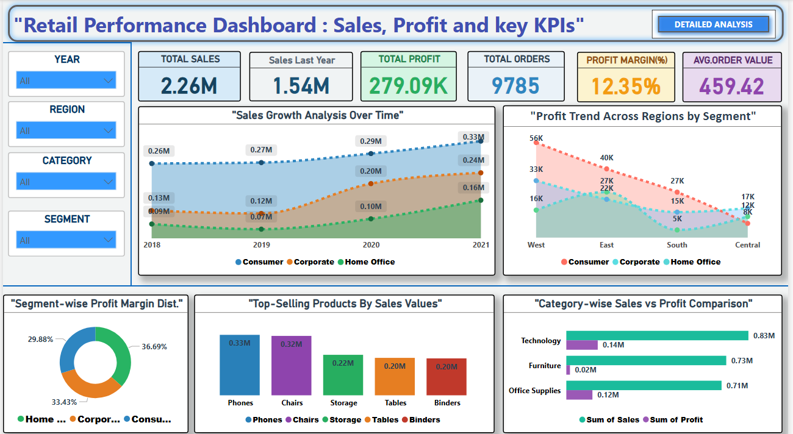
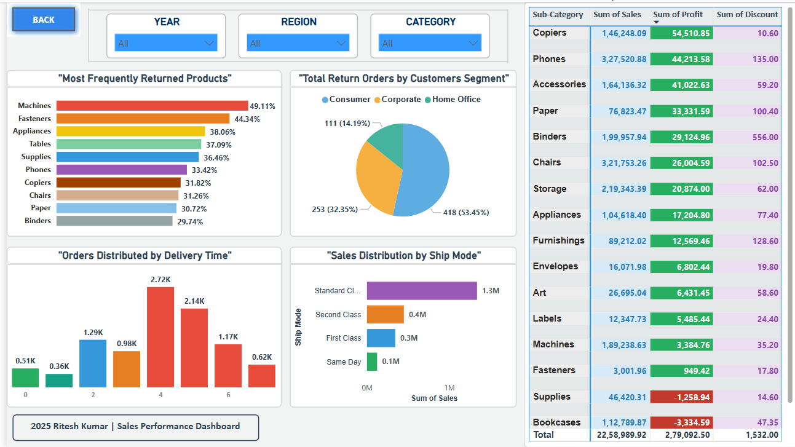

# 🛒 Retail Sales Performance Dashboard

This project is a Retail Performance Dashboard built in Power BI, showcasing key performance indicators like Sales, Profit, Orders, Profit Margin, and Customer Segment Returns. It also provides interactive filtering and data insights for business analysis.

---

 Project Overview

The dashboard covers:

-  Total Sales, Profit, Orders, and Avg. Order Value
-  Year-wise Sales Growth
-  Profit Trends by Region & Segment
-  Top-Selling Products by Sales
-  Most Frequently Returned Products
-  Sales by Ship Mode
-  Segment-wise Profit Margin
-  Delivery Time Distribution
-  Tabular data of Sub-Category with Sales, Profit, and Discount

---

 Dashboard Preview

 Page 1: KPI Analysis, Trend & Segment Insights

---

###  Page 2: Returns, Delivery, and Detailed Table

---

#  Key Features

- Dynamic filtering (Year, Region, Category, Segment)
- Interactive pie, bar, column, matrix, and line visuals
- Clean visual hierarchy and custom colors
- Easy to interpret insights for stakeholders

---

# Tools Used

- Power BI
- DAX
- Microsoft Excel (Data Source)

---

# Author

**Ritesh Kumar**  
📍 Noida, India  
📧 07mrriteshkr@gmail.com  
🔗 [LinkedIn](https://www.linkedin.com/in/ritesh-kumar-56807b329)

---

## Note
This dashboard was created using a sample retail dataset for learning and demonstration purposes.

